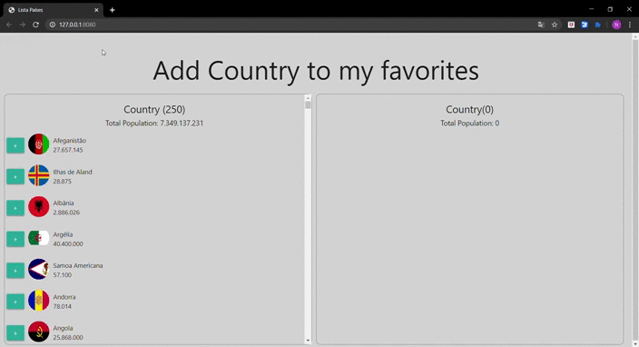

# Add-To-Favorite-Country
 Projeto que visa, escolher em uma lista de 250 países, qual o país que você mais gosta e adicionar a uma lista de favoritos. Projeto para treinar implementação de JavaScript puro.

 ---

 # Linguagem Utilizada
 ---
 * HTML
 * CSS
 * JavaScript
 * Materialize para os botões

 ---
 # Como rodar o projeto
 ---
 * Instalar o live-server 
 * Rodar o live-server na pasta raíz do projeto

 ---
 # Demonstração do funcionamento
 ---
 
